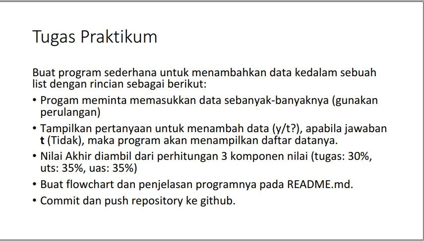
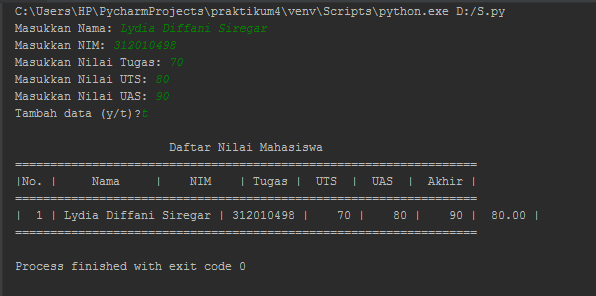
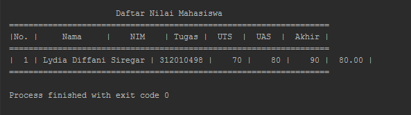
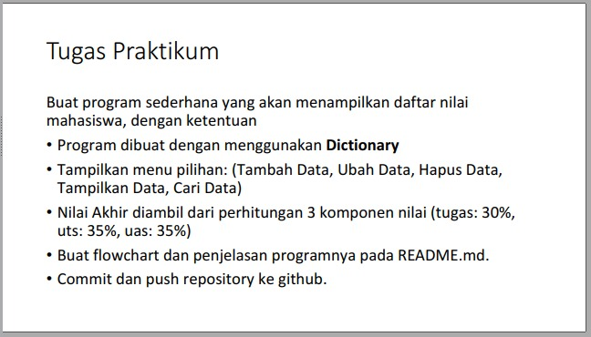
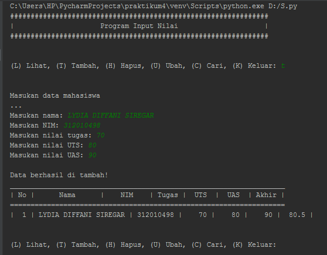

# Latihan-P9
<pre>
Nama    : LYDIA DIFFANI SIREGAR 
Kelas   : TI.20.A.1
NIM     : 312010498
Dosen   : Agung Nugroho S.Kom, M.Kom
</pre>

**Daftar Isi**
<p align="center">

| No. | Keterangan | Link |
| --- | --- | --- |
| 1 | Praktikum 4 | [Link](#Praktikum-4) |
| 2 | Pertemuan 5 | [Link](#Praktikum-5) |

</p>

***
 ## Praktikum 4
 
 Pada pertemuan ke-9 yang lalu, saya mendapat tugas untuk mengerjakan task yang terdapat didalam materi pada pertemuan ke-9, berikut tugas yang diberikan oleh dosen saya : <br>
<br>

<div align="center">

</div>
<br>

Untuk membuat program yang dimin ta, saya menggunakan source code sebagai berikut: <br>
```
nilai = []
ulang = True

while ulang:
    nama = input("Masukkan Nama: ")
    nim = input("Masukkan NIM: ")
    tugas = int(input("Masukkan Nilai Tugas: "))
    uts = int(input("Masukkan Nilai UTS: "))
    uas = int(input("Masukkan Nilai UAS: "))
    akhir = (tugas * 30/100) + (uts * 35/100) + (uas * 35/100)

    nilai.append([nama, nim, tugas, uts, uas, int(akhir)])
    if (input("Tambah data (y/t)?") == 't'):
        ulang = False

print("\n                      Daftar Nilai Mahasiswa")
print("==================================================================")
print("|No. |     Nama     |    NIM    | Tugas |  UTS  |  UAS  |  Akhir |")
print("==================================================================")
i = 0
for item in nilai:
    i += 1
    print("| {no:2d} | {nama:12s} | {nim:9s} | {tugas:5d} | {uts:5d} | {uas:5d} | {akhir:6.2f} |"
          .format(no=i, nama=item[0], nim=item[1], tugas=item[2], uts=item[3], uas=item[4], akhir=item[5]))
print("==================================================================")
```
<br>

Source code diatas akan menghasilkan output program sebagai berikut: <br>

<div align="center">

</div>
<br>

***

**Penjelasan** <br>
1. Membuat variable list kosong <br>
```
nilai = []
ulang = true
```
Variable `ulang = True` digunakan untuk mengontrol pengulangan. 
<br>

2. Kemudian setelah itu kita membuat kondisi perulangan dan statement yang akan dijalakan ketika perulangan terjadi. <br>
```
while ulang:
    nama = input("Masukkan Nama: ")
    nim = input("Masukkan NIM: ")
    tugas = int(input("Masukkan Nilai Tugas: "))
    uts = int(input("Masukkan Nilai UTS: "))
    uas = int(input("Masukkan Nilai UAS: "))
    akhir = (tugas * 30/100) + (uts * 35/100) + (uas * 35/100)

    nilai.append([nama, nim, tugas, uts, uas, int(akhir)])
```
Dari statement diatas. Kita diminta untuk menginput: <br>
**Nama** <br>
**NIM** <br>
**Nilai Tugas** <br>
**Nilai UTS** <br>
**Nilai UAS** <br>

Lalu sistem akan menjumlahkan nilai-nilai yang sudah diinput pada tiap-tiap nilai dan menghasilkan nilai akhir. Inputan itu kemudian masuk ke list **Akhir**.
<br>

3. Setelah membuat perulangan, kita membuat statement untung stop atau keluar dari loop yang aktif. <br>
```
  if (input("Tambah data (y/t)?") == 't'):
        ulang = False
```
Untuk bisa keluar dari loop yang aktif kita harus pilih option **t** pada statement diatas `**y/t**`. <br>
`y = yes` <br>
`n = no` <br>
Ketika kita memilih option **t** proses itu akan membuat variable `ulang = True` menjadi `ulang = False` kemudian akan menghentikan loop yang aktif <br>

4. Mencetak Hasil Input <br>
```
print("\n                      Daftar Nilai Mahasiswa")
print("==================================================================")
print("|No. |     Nama     |    NIM    | Tugas |  UTS  |  UAS  |  Akhir |")
print("==================================================================")
i = 0
for item in nilai:
    i += 1
    print("| {no:2d} | {nama:12s} | {nim:9s} | {tugas:5d} | {uts:5d} | {uas:5d} | {akhir:6.2f} |"
          .format(no=i, nama=item[0], nim=item[1], tugas=item[2], uts=item[3], uas=item[4], akhir=item[5]))
print("==================================================================")
```
**Dari source code diatas maka akan keluar output:**

<br>

<div align="center">

</div>
<br>

***
# Praktikum 5

Kemudian pada pertemuan tersebut terdapat pula tugas praktikum 5, berikut tugas yang diberikan: <br>

<div align="center">

</div> 
<br>

**Untuk membuat program yang diminta, saya menggunakan source code sebagai berikut:** <br>
<br>

```
print("###############################################################")
print("|                     Program Input Nilai                     |")
print("###############################################################")

data = {}

while True:
    print("\n")
    menu = input("(L) Lihat, (T) Tambah, (H) Hapus, (U) Ubah, (C) Cari, (K) Keluar: ")
    print("\n")

    # Keluar
    if menu.lower() == 'k':
        break

    # Lihat
    elif menu.lower() == 'l':
        print("Daftar Nilai:")
        print("===================================================================")
        print("| No |      Nama      |    NIM    | Tugas |  UTS  |  UAS  | Akhir |")
        print("===================================================================")
        no = 1
        for tabel in data.values():
            print("| {0:2} | {1:14} | {2:9} | {3:5} | {4:5} | {5:5} | {6:5} |".format
                  (no, tabel[0],
                   tabel[1], tabel[2],
                   tabel[3], tabel[4], tabel[5]))
            no += 1

    # Tambah
    elif menu.lower() == 't':
        print("Masukan data mahasiswa")
        print("...")
        nama = input("Masukan nama: ")
        nim = input("Masukan NIM: ")
        nilai_tugas = int(input("Masukan nilai tugas: "))
        nilai_uts = int(input("Masukan nilai UTS: "))
        nilai_uas = int(input("Masukan nilai UAS: "))
        nilai_akhir = (nilai_tugas)*30/100 + (nilai_uts)*35/100 + (nilai_uas)*35/100 
        data[nama] = [nama, nim, nilai_tugas, nilai_uts, nilai_uas, nilai_akhir]
        print('\nData berhasil di tambah!')
        print("___________________________________________________________________")
        print("| No |      Nama      |    NIM    | Tugas |  UTS  |  UAS  | Akhir |")
        print("===================================================================")
        no = 1
        for tabel in data.values():
            print("| {0:2} | {1:14} | {2:9} | {3:5} | {4:5} | {5:5} | {6:5} |".format
                  (no, tabel[0],
                   tabel[1], tabel[2],
                   tabel[3], tabel[4], tabel[5]))
            no += 1

    # Ubah
    elif menu.lower() == 'u':
        nama = input("Masukan nama untuk mengubah data: ")
        if nama in data.keys():
            print("Mau mengubah apa?")
            sub_data = input("(Semua), (Nama), (NIM), (Tugas), (UTS), (UAS) : ")
            if sub_data.lower() == "semua":
                print("==========================")
                print("Ubah data {}.".format(nama))
                print("==========================")
                data[nama][1] = input("Ubah NIM:")
                data[nama][2] = int(input("Ubah Nilai Tugas: "))
                data[nama][3] = int(input("Ubah Nilai UTS: "))
                data[nama][4] = int(input("Ubah Nilai UAS: "))
                data[nama][5] = data[nama][2] *30/100 + data[nama][3]*35/100 + data[nama][4] *35/100 
                print("\nBerhasil ubah data!")
                print("___________________________________________________________________")
                print("| No |      Nama      |    NIM    | Tugas |  UTS  |  UAS  | Akhir |")
                print("===================================================================")
                no = 1
                for tabel in data.values():
                    print("| {0:2} | {1:14} | {2:9} | {3:5} | {4:5} | {5:5} | {6:5} |".format
                        (no, tabel[0],
                        tabel[1], tabel[2],
                        tabel[3], tabel[4], tabel[5]))
                    no += 1
            elif sub_data.lower() == "nim":
                data[nama][1] = input("NIM:")
                print('Data berhasil di ubah!')
            elif sub_data.lower() == "tugas":
                data[nama][2] = int(input("Nilai Tugas: "))
                print('Data berhasil di ubah!')
            elif sub_data.lower() == "uts":
                data[nama][3] = int(input("Nilai UTS: "))
                print('Data berhasil di ubah!')
            elif sub_data.lower() == "uas":
                data[nama][4] = int(input("Nilai UAS: "))
                print('Data berhasil di ubah!')
            else:
                print("menu tidak ditemukan.")

        else:
            print("'{}' tidak ditemukan.".format(nama))

    # Cari
    elif menu.lower() == 'c':
        print("Mencari data: ")
        print("=================================================")
        nama = input("Masukan nama untuk mencari data: ")
        if nama in data.keys():
            print('\nResult')
            print("Nama: {0}\nNIM : {1}\nNilai Tugas: {2}\nUTS: {3}\nUAS: {4}\nNilai akhir: {5}"
                  .format(nama, data[nama][1],
                                data[nama][2], data[nama][3],
                                data[nama][4], data[nama][5]))
        else:
            print("'{}' tidak ditemukan.".format(nama))

    # Hapus
    elif menu.lower() == 'h':
        nama = input("Masukan nama untuk menghapus data : ")
        if nama in data.keys():
            del data[nama]
            print("sub_data '{}' berhasil dihapus.".format(nama))
        else:
            print("'{}' tidak ditemukan.".format(nama))

    else:
        print("Upss ada yang salah, silahkan cek kembali.")
```

**Source Code diatas akan menghasilkan output seperti dibawah ini:** <br>

<div align="center">

</div> 
<br>

***

## Penjelasan:

**Header:**

- `data={}` : Ini digunakan untuk menampung list dengan format **dictionary**. <br>

- `while`   : Ini digunakan untuk menampilkan data perulangan sebanyak-banyaknya. <br>

- `menu = input("(T)ambah), (U)bah, (H)apus, (L)ihat, (C)ari, (K)eluar: ")` : Untuk menambah opsi **Tambah/Ubah/Hapus/Lihat Data/Cari/Keluar** dari variable menu. <br>

- `else: print("Data ada yang salah, silahkan cek kembali.")` : Ini output jika kita salah dalam input makan akan tercetak `Data ada yang salah, silahkan cek kembali.`<br>

- Masukan **Nama, NIM, Nilai Tugas, Nilai UTS, Nilai UAS, dan Nilai Akhir** kemudian nanti akan dimasukkan kedalam `data={}`<br>

- Nilai akhir didapat dari = (nilai_tugas)*30/100 + (nilai_uts)*35/100 + (nilai_uas)*35/100
<br>

**Keluar:**

- `if menu.lower() == 'k'`  : Ambil data 'k' dari `menu`

- Setelah itu kita `break` untuk menghentikan seluruh proses yang berjalan.
<br>

**Lihat Data:**

- `if menu.lower() == 'I'`   : Kita menggunakan kondisi percabangan **if**, ambil data dari `menu` kemudian kita mengubah perintah 'I' yang kita input menjadi huruf kecil dengan fungsi `lower()` 

- Kemudian kita cetak `print()`
<br>

**Tambah Data:**

- `elif menu.lower()  == 't'`   : Ambil data 't' dari `menu` 

- `nama = input("Masukan nama: ")` lalu kita tambahkan input **Nama, NIM, Nilai Tugas, UTS, UAS**

- `nilai_akhir = (nilai_tugas)*30/100 + (nilai_uts)*35/100 + (nilai_uas)*35/100`    : untuk nilai akhir diambil dari perhitungan 3 Komponen yang sudah diinput **(nilai_tugas: 30%, nilai_uts: 35%, nilai_uas: 35%)**

- `data[nama] = [nama, nim, nilai_tugas, nilai_uts, nilai_uas, nilai_akhir]` disini kita akan memasukkan data yang tadi kita input, kemudian diinput kedalam `data[nama]`.

- Kemudian kita cetak `print()`
<br>

**Ubah Data**

- `elif menu.lower()  == 'u'`   : Ambil data 't' dari `menu`

- `nama = input("Masukan nama untuk mengubah data: ")` kemudian kita input nama yang akan diubah.

- `if nama in data.keys(): print("Mau mengubah apa?")` jika `nama` dari dalam `data` maka akan kembali ke daftar menggunakan fungsi `keys()` lalu di cetak dengan `print()`

- `sub_data = input("(semua)), (Nama), (NIM), (Tugas), (UTS), (UAS): ")` ini untuk mengubah menu di `sub_data`

- `if sub_data.lower() == "semua"`  : ambil kata kunci 'semua' di dalam `sub_data` <br>
Jika **'semua'** maka input data di `[nama][1] = input("Ubah NIM:")`<br>
`data[nama][2] = int(input("Ubah Nilai Tugas: ")) data[nama][3] = int(input("Ubah Nilai UTS: ")) data[nama][4] = int(input("Ubah Nilai UAS: "))`

- `data[nama][5] = data[nama][2] *30/100 + data[nama][3]*35/100 + data[nama][4] *35/100` maka kita akan dapatkan nilai akhir dengan diambil dari perhitungan 3 komponen nilai **(tugas: 30%, uts: 35%, uas: 35%)**

***Ket: [5] nilai_akhir, dimana [0] = nama***

- Kemudian kita cetak `print()`

- Jika kita ingin mengubah data tertentu maka `elif sub_data.lower() =="nim": data[nama][1] = input("NIM"") fungsi ini berlaku juga untuk **Nilai Tugas, UTS dan UAS**

- Kemudian kita cetak `print()`

- `else: print("'{}' tidak ditemukan.".format(nama))`   : Jika kita salah dalam memasukkan nama untuk diubah, maka data akan muncul di '**nama tidak di temukan**'.
<br>

**Cari Data**

- `elif menu.lower() == `c`:` Ambil Data 'c' dari `menu`

- `nama = input("Masukan nama untuk mencari data: ")`   kita akan menginput data yang nanti akan kita cari.

- `if nama in data.keys():` kita mengambil nama dari list '**nama**' di dalam '**data**' menggunakan *pengkodisian*.

- Kemudian kita cetak `print("nNama: {0}/nNIM : {1}/nNilai Tugas: {2}/nUTS: {3}/nUAS: {4}/nNilai Akhir: {5}"` digunakan untuk menampilkan data yang tersedia.

- `else: print("'{}' tidak ditemukan.".format(nama))`   : Jika kita salah dalam memasukkan nama untuk diubah, maka data akan muncul di '**nama tidak di temukan**'.
<br>

**Hapus Data**

- `elif menu.lower() == 'h':` Ambil data 'h' dari `menu`

- `nama = input("Masukan nama untuk mencari data: ")`   kita akan menginput data yang nanti akan kita hapus.

- `if nama in data.keys():` kita mengambil nama dari list '**nama**' di dalam '**data**' menggunakan *pengkodisian*.

- `del data[nama]` Untuk menghapus semua '**Nama**' yang ada didalam `data`.

- Kemudian maka di cetak `print("sub_data '{}' berhasil dihapus.".format(nama))`

- `else: print("'{}' tidak ditemukan.".format(nama))`   : Jika kita salah dalam memasukkan nama untuk diubah, maka data akan muncul di '**nama tidak di temukan**'.
<br>

<div align="center">

</div> 
<br>

***

# Terimakasih